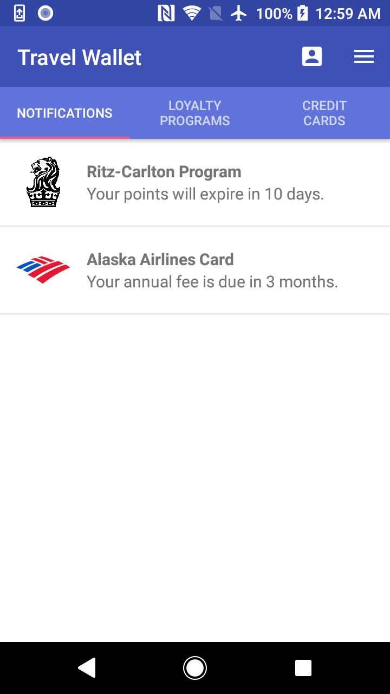
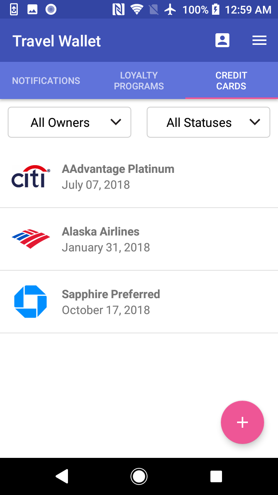
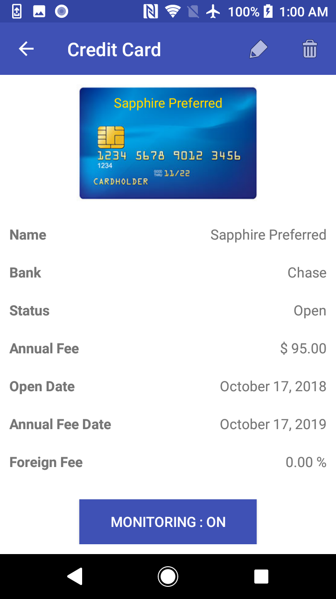

# Travel Wallet

Travel Wallet helps you keep manage your loyalty programs and credit cards. It's a free app packed with useful features for travelers.

Features:

- Specifically designed for travelers. No internet connection required.
- 100% Ad-free
- Database of 250+ credit cards from US and Canada
- Database of 40+ loyalty programs (airlines, hotels, rental cars, etc.)
- Supports multiple users
- Calculates Chase 5/24 status (US Only)

## Installation

This application is listed on the Google Play store and can be downloaded and installed directly from there.

This application requires Android 4.0.3 "Ice Cream Sandwich" or higher (API 15+).

[Google Play Store Link](https://play.google.com/store/apps/details?id=com.davidlcassidy.travelwallet "Travel Wallet")

## Getting Started

### Introduction

Travel Wallet primarily consist of three interfaces, each with its own tab and display window.

- Notifications Interface - Displays notifications from both the loyalty programs and the credit cards
- Loyalty Program Interface - Provides users the ability add, view, edit, and delete loyalty programs
- Credit Card Interface - Provides users the ability add, view, edit, and delete credit cards

Along with these three interfaces, there are two buttons located on the top of the main screen. The first is the Owners button allowing the user to manage multiple program/card owners. The second is a dropdown menu where the user can modify app settings, open a summary report, view the developer's note, and upgrade to Travel Wallet Pro if they have not already.

### Notifications Interface

Both loyalty program and credit card notifications will appear in the first tab titled Notifications and are sorted by time remaining until the approaching event date. There are currently two types of event notifications that are sent:

- Upcoming loyalty program points expiration
- Upcoming credit card annual fee

In the Settings, the user can adjust the period of time before these events that a notification will be sent. Furthermore, monitoring of each individual loyalty program and credit card can be turned on or off, dictating whether or not notifications will be sent. This makes for a flexible notifications interface that is customizable to the needs of each user.

Along with the Notifications tab, Travel Wallet can also send push notifications to the phone status bar in real time. This can be useful for users who would like to be automatically notified of events rather than regularly opening the app and manually checking their notifications. These phone notifications can be turned on/off in the Settings. 

Phone notifications can be cleared, but individual notifications within the app can not be cleared or snoozed. They will remain until they are resolved or their monitoring turned off. Finally, note that clicking on each notification within the app will route the user to the loyalty program or credit card causing the notification.

### Loyalty Programs Interface

Loyalty programs will appear in the second tab titled Loyalty Programs. New loyalty programs are added by clicking the round plus button in the bottom right corner. Once programs have been added, the main screen will show a list of all added programs. The sort order and primary display field can be configured in the Settings. Clicking on a program will pull up that program's detail screen displaying all fields for that program along a button to toggle the notification monitoring for the specific program. On the top of the detail screen, there are also buttons for editing or deleting the specific program.

### Credit Cards Interface

Credit cards will appear in the third tab titled Credit Cards. The credit card interface functions essentially the same as the loyalty program interface in regards to adding, viewing, editing, and deleting credit cards.

### Travel Wallet Pro

The free version of Travel Wallet is limited to two users, ten loyalty programs, and ten credit cards. Purchasing Travel Wallet Pro will release these limits and unlock an exclusive Gold color scheme. There is an option to upgrade to Travel Wallet Pro in the dropdown menu in the top right corner of the main screen.

## Screenshots

  
  
  

  
  
  

## Building from Source

### Requirements

- Android SDK v15+
- Latest Android Build Tools
- Android Support Repository

### Installation

This project uses the Gradle build system.

1. Download the project by cloning this repository or downloading a snapshot.
1. In Android Studio, create a new project and choose the "Import Project" option.
1. Select the "Travel Wallet" directory that you downloaded with this repository.
1. If prompted for a gradle configuration, accept the default settings. Alternatively use the "gradlew build" command to build the project directly.

## Contributions

Pull requests and GitHub issues are welcome!

If you would like to do a pull request, please get in touch with me before you start writing code so we 
can avoid duplicated effort or unnecessary work.

## Copyright

Travel Wallet Android App

Copyright (C) 2018 David L Cassidy. All rights reserved.
